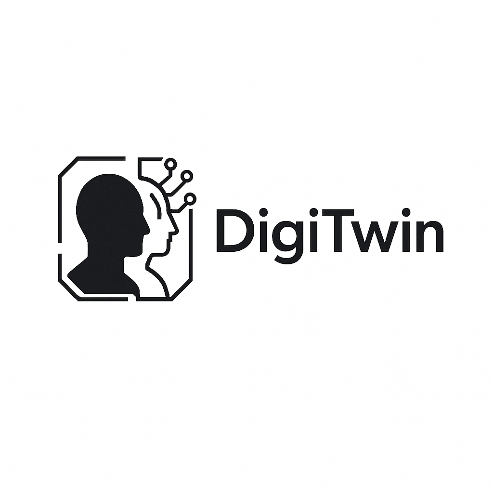

# DigiTwin

## Table of Contents
- [Unlock Your Legacy](#unlock-your-legacy)
- [About DigiTwin](#about-digitwin)
- [Features](#features)
- [Demo](#demo)
- [Getting Started](#getting-started)
- [Technologies Used](#technologies-used)
- [Deployment](#deployment)
- [Contributing](#contributing)
- [License](#license)
- [Contact](#contact)
- [Acknowledgments](#acknowledgments)

## Unlock Your Legacy

Preserve your life, memories, and personality forever. DigiTwin empowers you to create a true-to-life digital copy that can share your story, wisdom, and values with loved ones—now and in the future.

---

## About DigiTwin

DigiTwin is a platform designed to help you create the most accurate digital twin of your personality. By answering a detailed questionnaire, you enable DigiTwin to build a digital persona capable of realistically interacting on your behalf. The more thoughtful and comprehensive your answers, the more authentic and lifelike your digital twin will be.

### Why DigiTwin?
- **Preserve your story:** Ensure your experiences, values, and wisdom are never lost.
- **Connect across generations:** Share your legacy with loved ones, now and in the future.
- **True-to-life interaction:** Your digital twin can converse and interact as you would, powered by your unique personality and memories.

---

## Features
- Create a digital twin of your personality
- Interactive, detailed questionnaire
- Audio and text input support
- Modern, responsive UI
- Share your digital legacy with loved ones

---

## Demo

[Live Demo](https://digi-twin.tervahagn.com)

---

## Getting Started

### 1. Clone the Repository
```sh
git clone <YOUR_GIT_URL>
cd digi-twin
```

### 2. Install Dependencies
```sh
npm install
```

### 3. Start the Development Server
```sh
npm run dev
```

### 4. Begin Your Journey
Open your browser and follow the onboarding process to start building your digital twin. Answer the questionnaire as thoroughly as possible for the best results.

---

## Technologies Used
- Vite
- TypeScript
- React
- shadcn/ui
- Tailwind CSS

---

## Deployment
To deploy DigiTwin, use your preferred hosting provider. For static hosting, build the project with:
```sh
npm run build
```
Then serve the contents of the `dist` directory.

---

## Contributing
We welcome contributions! Please open issues or submit pull requests to help improve DigiTwin.

### Configuring the `send-survey-email` function
The `supabase/functions/send-survey-email` function communicates with your Supabase
project. When running or deploying this function with the Supabase CLI, set the
following environment variables so it can access your project's database:

- `SUPABASE_URL` – your Supabase project URL
- `SUPABASE_SERVICE_ROLE_KEY` – the service role key for your project

You can retrieve these values from your Supabase dashboard under **Project
Settings → API**. For additional details see the
[Supabase Functions environment variables documentation](https://supabase.com/docs/guides/functions#environment-variables).

---

## License
This project is licensed under the MIT License.

---

## Contact
For questions or support, please contact the project maintainer or visit [https://tervahagn.com](https://tervahagn.com).
